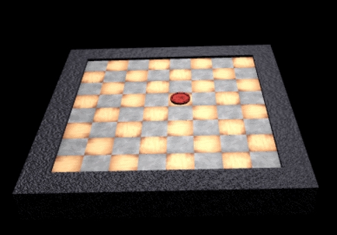

ThreeJS Board Game
==================

A 3D rendered board game framework utilizing threejs.

Now available at:

[Live Three JS Board Game by Ryan Montgomery](http://lumpy-plants.surge.sh/)

MVP
---

At minimum, the game should allow two or more players to play a board game
against each other on the same screen. Players will take turns moving their
pieces until a victor is determined.

 

Flow
----

An introduction page will be displayed when the site is loaded. A player will
choose from the available games, set the number of players and begin.

 

Each turn the current player will be displayed prominently at the top of the
screen. The player’s pieces will be softly highlighted until the player selects
a piece to move. Then, the locations that this piece can move to will be
strongly highlighted. The player can cancel, placing his piece back in it’s
original position, or he/she can select an available position to move to.

 

The turns will repeat until victory conditions are met.

 

Challenges
----------

### Asset Loading

A three dimensional environment requires large assets like meshes and textures
to be transferred to client. Initial tests showed a brief delay loading a single
checker piece. More complex games, like chess, will require more meshes. An
effort should be made to minimize the impact of data transfer on the player.
Synchronous loading with state management might provide a solution by preventing
exposure to assets before load. Temporary decimated meshes with procedural
threejs materials could be used to allow the app to continue before the full
data is ready.

 

### Interface on Multiple Devices

Interaction with a 3D environment is different when using a touch screen, mouse,
or vr controls. The application should support multiple modes of interaction to
provide the best experience across multiple devices.

1.  Touch or Mobile

    -   View rotation should be limited so that interaction with the 3D
        environment does not interfere with the interaction with the game.
        Controls should be provided to switch between top view and two isometric
        views.

    -   A player should select pieces with a single tap. Available movement
        locations will be highlighted and the player can tap again to move to a
        new location or cancel the move and select a new piece.

2.  Mouse

    -   The player can fully rotate the environment by clicking and dragging in
        open space. Pieces and locations will highlight on hover.

    -   The player can move pieces using the same method as above, or by
        clicking and dragging the piece to a new location.

 

### Abstraction

It should be easy to implement new games within the framework. Ideally chess and
checkers will be included as part of the MVP.

 

 

 

 

Notes
-----

-   Meshes and textures are not loading in chrome. Need to figure out why. Works
    fine in Firefox and Edge.
